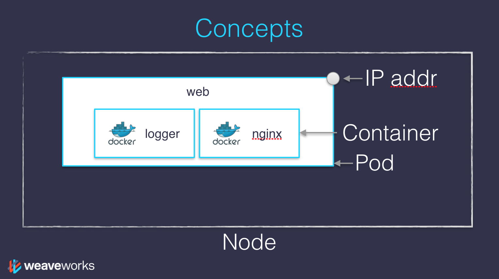

# Kubernetes concepts

- Kubernetes is a platform for managing containerized workloads and services, that facilitates declarative configuration and automation.

- Kubernetes provides a **container-centric** management environment. It orchestrates computing, networking, and storage infrastructure on behalf of user workloads.

---

## Basic things we can ask Kubernetes to do

- Start 5 containers using image `atseashop/api:v1.3`

- Place an internal load balancer in front of these containers

- Start 10 containers using image `atseashop/webfront:v1.3`

- Place a public load balancer in front of these containers

- It's Black Friday, traffic spikes, grow our cluster and add containers

- New release! Replace my containers with the new image `atseashop/webfront:v1.4`

- Keep processing requests during the upgrade; update my containers one at a time

---

## Other things that Kubernetes can do for us

- Basic autoscaling
- Blue/green deployment, canary deployment
- Long running services, but also batch (one-off) jobs
- Overcommit our cluster and *evict* low-priority jobs
- Run services with *stateful* data (databases etc.)
- Fine-grained access control defining *what* can be done by *whom* on *which* resources
- Integrating third party services (*service catalog*)
- Automating complex tasks (*operators*)

---

## Kubernetes architecture

---

## Nodes

- The nodes executing our containers run a collection of services:

  - a container Engine (typically Docker)

  - kubelet (the "node agent")

  - kube-proxy (a necessary but not sufficient network component)

- Nodes were formerly called "minions"

  (You might see that word in older articles or documentation)

---

## The Control plane

- The Kubernetes logic (its "brains") is a collection of services:

  - the **API server** (our point of entry to everything!)

  - core services like the **scheduler** and **controller manager**

  - **etcd** (a highly available key/value store; the "database" of Kubernetes)

- Together, these services form the control plane of our cluster

- The control plane is also called the **"master"**

---

---

## Running the control plane on special nodes

- It is common to reserve a dedicated node for the control plane
  (Except for single-node development clusters, like when using minikube)
- This node is then called a "master"
  (Yes, this is ambiguous: is the "master" a node, or the whole control plane?)
- Normal applications are restricted from running on this node
  (By using a mechanism called ["taints"](https://kubernetes.io/docs/concepts/configuration/taint-and-toleration/))
- When high availability is required, each service of the control plane must be resilient
- The control plane is then replicated on multiple nodes
  (This is sometimes called a **"multi-master"** setup)

---

## Running the control plane outside containers

- The services of the control plane can run in or out of containers

- For instance: since `etcd` is a critical service, some people
  deploy it directly on a dedicated cluster (without containers)

- In some hosted Kubernetes offerings (e.g. AKS, GKE, EKS), the control plane is invisible

  (We only "see" a Kubernetes API endpoint)

- In that case, there is no "master node"

*For this reason, it is more accurate to say "control plane" rather than "master."*

---

## Do we need to run Docker at all?

**No... But for the moment Yes!**

- By default, Kubernetes uses the Docker Engine to run containers

- We could also use `rkt` ("Rocket") from CoreOS

- Or leverage other pluggable runtimes through the *Container Runtime Interface*

  (like **CRI-O**, or **containerd**)

- On our development environments, CI pipelines ... :
*Yes, almost certainly*

- On our production servers:
*Yes (today)*
*Probably not (in the future)*

---

## Interacting with Kubernetes

- We will interact with our Kubernetes cluster through the Kubernetes API

- The Kubernetes API is (mostly) RESTful

- It allows us to create, read, update, delete *resources*

- A few common resource types are:

  - **node** (a machine — physical or virtual — in our cluster)

  - **pod** (group of containers running together on a node)

  - **service** (stable network endpoint to connect to one or multiple containers)

---

---

---

---

# Declarative vs imperative

Our container orchestrator puts a very strong emphasis on being declarative

### Declarative : 
<!-- .element: class="fragment" data-fragment-index="1"-->
I would like a cup of tea.
<!-- .element: class="fragment" data-fragment-index="1"-->

### Imperative :
<!-- .element: class="fragment" data-fragment-index="2"-->
Boil some water. Pour it in a teapot. Add tea leaves. Steep for a while. Serve in a cup.
<!-- .element: class="fragment" data-fragment-index="2"-->

---

**Declarative seems simpler at first ...**
**As long as you know how to brew tea**
<!-- .element: class="fragment" data-fragment-index="1"-->

### What declarative would really be :
<!-- .element: class="fragment" data-fragment-index="2"-->
I want a cup of tea, obtained by pouring an infusion of tea leaves in a cup.
An infusion is obtained by letting the object steep a few minutes in hot water.
Hot liquid is obtained by pouring it in an appropriate container and setting it on a stove.
<!-- .element: class="fragment" data-fragment-index="2"-->