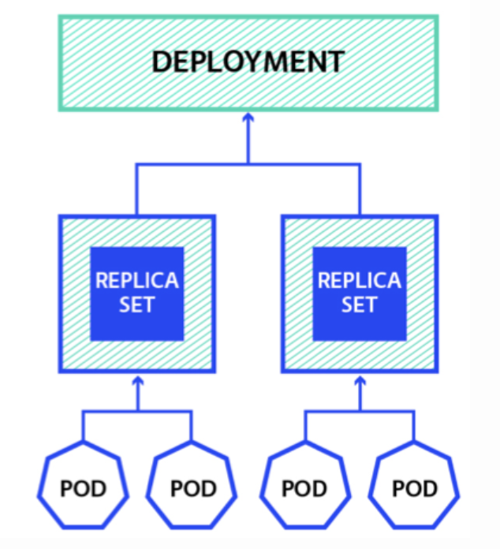
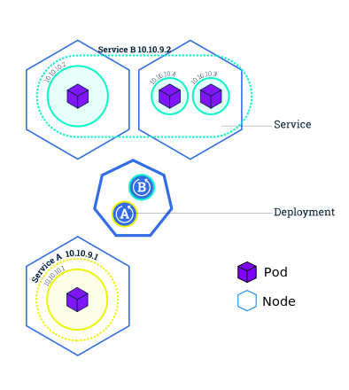

# Base objects
- Pod
- Service
- Volume
- Namespace
...

---

## Pods

In Docker World, Every Microservice is deployed as Container.
In K8s world, A Pod is the basic building block of K8s Objects.

A pod is a **colocated group of containers**.
A pod can contain single container as well.
But when it contains multiple containers, all of the containers are running on single worker node.
A pod won’t distribute across multiple worker nodes.

```yaml
apiVersion: v1
kind: Pod
metadata:
  name: myapp-pod
  labels:
    app: myapp
spec:
  containers:
  - name: myapp-container
    image: busybox
    command: ['sh', '-c', 'echo Hello Kubernetes! && sleep 3600']
```
<!-- .element: class="fragment" -->

---

## Services
**Logical set of Pods**

An abstract way to expose an application running on a set of Pods as a network service.

```yaml
apiVersion: v1
kind: Service
metadata:
   name: myapp-service
spec:
  ports:
  - port: 80
    protocol: TCP
  selector:
     app: myapp
``` 
<!-- .element: class="fragment" -->

---

## Volume
In Docker, a volume is simply a directory on disk or in another Container. Lifetimes are not managed.

A Kubernetes volume, has an explicit lifetime (the same as the Pod that encloses it).
Data is preserved across Container restarts.

Some types of Volumes: awsElasticBlockStore, iscsi, local, nfs, glusterfs, ... 
<!-- .element: class="fragment" -->

---

## PersistentVolume and PersistentVolumeClaim

Abstracts details of how storage is provided from how it is consumed.

| Type of storage | How long does it last?  |
| ------------- | -----|
| Container filesystem | Container lifetime |
| Volume (k8s) | Pod lifetime |
| Persistent volume | Cluster lifetime |

---

## Namespaces

Kubernetes supports multiple **virtual clusters** backed by the same physical cluster.
These virtual clusters are called namespaces.

Namespaces are intended for use in environments with many users spread across multiple teams, or projects

---

# Controllers 
- ReplicaSet
- Deployment
- StatefulSet
- DaemonSet
- Job
...

---

## ReplicaSet
A ReplicaSet **ensures that a specified number of pod replicas are running at any given time**.
However, a Deployment is a higher-level concept that manages ReplicaSets and provides declarative updates to Pods along with a lot of other useful features. Therefore, we recommend using Deployments instead of directly using ReplicaSets, unless you require custom update orchestration or don’t require updates at all.

This actually means that you may never need to manipulate ReplicaSet objects: **use a Deployment instead**, and define your application in the spec section.


---

## Deployments

A Deployment controller provides **declarative** updates for **Pods** and **ReplicaSets**.
You describe a **desired state** in a Deployment object, and the Deployment controller changes the actual state to the desired state at a controlled rate.

```yaml
apiVersion: apps/v1
kind: Deployment
metadata:
  name: nginx-deployment
  labels:
    app: nginx
spec:
  replicas: 3
  selector:
    matchLabels:
      app: nginx
  template:
    metadata:
      labels:
        app: nginx
    spec:
      containers:
      - name: nginx
        image: nginx:1.7.9
        ports:
        - containerPort: 80
```
<!-- .element: class="fragment" -->

---

## DaemonSet
A DaemonSet **ensures that all (or some) Nodes run a copy of a Pod**. 

Usefull for monitoring hosts or collect logs for example.

## StatefulSet  
<!-- .element: class="fragment" data-fragment-index="1"-->
StatefulSet is the workload API object used to <!-- .element: class="fragment" data-fragment-index="1"--> **manage stateful applications**.
<!-- .element: class="fragment" data-fragment-index="1"-->

---



---


